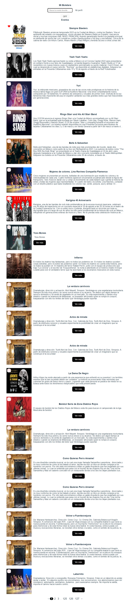

# Proyecto: Eventos Ticketmaster de México

Este proyecto pertenece al [Curso Profesional de React](https://codigofacilito.com/cursos/react-profesional) de la plataforma Código Facilito. El proyecto realiza consultas a la API de [TicketMaster](https://developer.ticketmaster.com/products-and-docs/apis/discovery-api/v2/) y el resultado de dichas consultas son renderizadas por medio de la creación de componentes de React. El proyecto permite practicar conceptos y aplicar dichos conceptos a medida que se va avanzando en el desarrollo del proyecto. El curso contiene muchísimo material y muchas cosas solo son comprendidas cuando se esta en la instancia en que se necesitan. La única manera de comprender tales conceptos es realizando proyectos de complejidad creciente para poco a poco ir comprendiendo tales conceptos más avanzados.

## Página Principal del Proyecto

